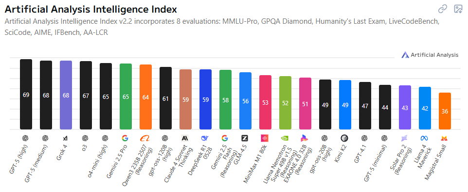

# Språkmodeller för utvecklare

- **Syfte**: Förstå skillnader mellan modeller, tokens och priser, vad reasoning innebär, samt när man väljer vilken modell.

---

<!--
Idag finns det väldigt många språkmodeller att välja mellan, och det är inte helt enkelt att välja mellan dem.

Här ser ni de idag högst presterande modellerna när man har evaluerat dem mot åtta olika benchmarks som testar  allt ifrån modellarnas förmåga att följa instruktioner och skriva kod, till biologi och kemi.
-->

---

<!--
Om man istället bara kollar på resultatet från de två kod-benchmarksen så ser resultatet istället ut såhär.

Här kan man se att GPT-5 som tidigare låg på en första plats har tappat ganska mycket, och att den mest populära modellen för kodagenter, Claude 4 Sonnet, ligger ganska långt ifrån toppen.
-->

---

## Att välja modell

- Benchmarks säger någonting, men långt ifrån allt.
<!--
Resultaten från såna här evalueringar används ofta i marknadsföringssyfte och det finns risk för att företagen har anpassat sina modeller för att bättre klara av frågor som är väldigt lika dem i dessa tester, eller att de exakta frågorna har funnits med i träningsdatan.
-->
- Det finns ingen modell som är bäst på allt.
<!--
Olika användningsområden kräver olika modeller.

Du kommer inte vilja använda samma modell för att göra en snabb kodändring över ett par markerade rader, som den du använder för att rådfråga om en komplex arkitektursfråga.
-->

- Svarskvalitet är inte det enda att ta hänsyn till, även hastighet och kostnad spelar roll.
<!--
Det är alltid en balansgång mellan dessa faktorer.

Om du startar en agent som arbetar i bakgrunden medan du själv jobbar med något annat, så bryr du dig förmodligen inte om hastigheten, kvaliteten är viktigast. Men om det är en ändring på koden du sitter med just nu så spelar det större roll.
-->

---

## Andra faktorer

- **Context window**: hur många tokens _(1 token ≈ 3–5 tecken)_ modellen kan hantera samtidigt.
<!--
Alltså hur mycket text du kan skicka med i en fråga. Detta börjar spela roll om du t.ex. vill skicka med stora delar av en kodbas, loggar, dokumentation eller andra långa texter.

Idag så klarar de mest populära modellerna stora context windows. Claude 4 Sonnet och Gemini 2.5 Pro klarar t.ex. en miljon tokens vilket motsvarar ungefär 100 000 rader kod. GPT-5 klarar 400 000 tokens.
-->

- **Säkerhet**: var skickas din data?
<!--
Här är det egentligen inte modellen som spelar någon roll, utan det är vem som servear modellen till dig. Modellen är i stort sett bara ett enormt antal vektorer och utgör i sig ingen fara.

Så t.ex. är det säkert att använda kinesiska modeller bara den serveas utav en pålitlig leverantör som t.ex. Microsoft via Azure eller Amazon via AWS.
-->

- **Function/tool calling**: behöver du att modellen klarar av att använda externa verktyg?
<!--
Om du ska använda modellen i agenter så som t.ex. Copilot är detta ofta avgörande och det kan skilja väldigt mycket mellan olika modeller.
-->

---

## Tool calling

- **Vad är tool calling?** Modellen anropar definierade verktyg med strukturerade argument för att t.ex. söka/läsa/skriva filer, köra kommandon eller skicka ett meddelande i Slack.
<!--
I Copilot‑kodagenten i VS Code innebär det att modellen själv väljer när den ska använda t.ex. kodsökning, öppna/läsa/skriva filer, köra tester eller git‑kommandon. Du beskriver målet; modellen planerar och orkestrerar anropen.
-->

- Stor skillnad mellan modeller.
<!--
Claude-modellerna från Anthropic är väldigt bra på tool calling och att följa instruktioner, och har varit det ganska länge nu. Detta är anledningen till att Claude-modellerna är så populära att använda i agenter och kodgenereringsverktyg.

Men detta är något som alla har börjat fokusera mer på och prioritera när modellerna tränas, så många av de nyare modellerna är ganska bra på detta, och det spelar också väldigt stor roll hur modellerna promptas för tool calling.
-->

---

## Prissättning: input vs output

- De flesta leverantörer tar betalt per token, separat för input och output.
- Outputtokens är ofta dyrare än inputtokens.
- Enkel kostnadsformel: \(\text{kostnad} = \text{tokens}_{in} \times pris_{in} + \text{tokens}_{out} \times pris_{out}\).
- Exempel (hypotetiskt): 800 in + 200 ut, pris_in = $0.5/1k, pris_out = $2/1k → kostnad ≈ $0.8 × $0.5 + $0.2 × $2 = $0.4 + $0.4 = $0.8.
- Tips: Begränsa max outputtokens, använd sammanfattningar och strukturera svar för förutsägbar längd.

---

## Modelltyper (översikt)

- **Icke‑resonerande ("snabba")**: Optimerade för latens och pris. Bra på direktuppgifter: omskrivning, extraktion, enklare kod, chat.
- **Resonerande**: Har intern "tankeprocess". Dyrare och långsammare men bättre på komplex problemlösning, planering, flerstegsuppgifter.
- **Storlek**: Mindre (billigare, snabbare) vs större (bättre allmänt, robustare). Välj minsta som klarar kraven.
- **Multimodala**: Tar text + bild/ljud/video. Praktiskt för kvitton, grafer, skärmdumpar, UI-förståelse.
- **Öppen källkod vs sluten**: Självhosta för kontroll/sekretess; molnmodeller för toppkvalitet och enkelhet.

---

## Reasoning vs non‑reasoning

- **Non‑reasoning**: Låg latens, låg kostnad, förutsägbara svar. Tappar kvalitet vid lång kedja av beroenden.
- **Reasoning**: Producerar/optimerar intern kedja av resonemang. Högre noggrannhet i komplexa stegvis-uppgifter, men dyrare och långsammare.
- Vanliga symptom: reasoning-modeller kan "tänka längre" och är robustare mot små promptvariationer.

---

## När välja reasoning?

- Flerstegslogik, formella bevis/beräkningar, icke-trivial felsökning.
- Planering över längre horisonter (jobbförslag, roadmap, pipeline-design).
- Strikt verktygsorkestrering: välja rätt verktyg i rätt ordning.
- När A/B visar för stor kvalitetsförlust med billigare modell.

---

## När välja icke‑reasoning / liten modell?

- Texttransformationer: översättning, sammanfattning, tonläge, formatering.
- Informationsutvinning: nyckelfält ur kvitton/loggar, korta Q&A över känd fakta.
- Enklare kodassistans (små diffar, boilerplate), generering av testfall från mall.
- Hög volym, hårda SLO:er för latens och kostnad.

---

## Sammanfattning

- TODO

---
